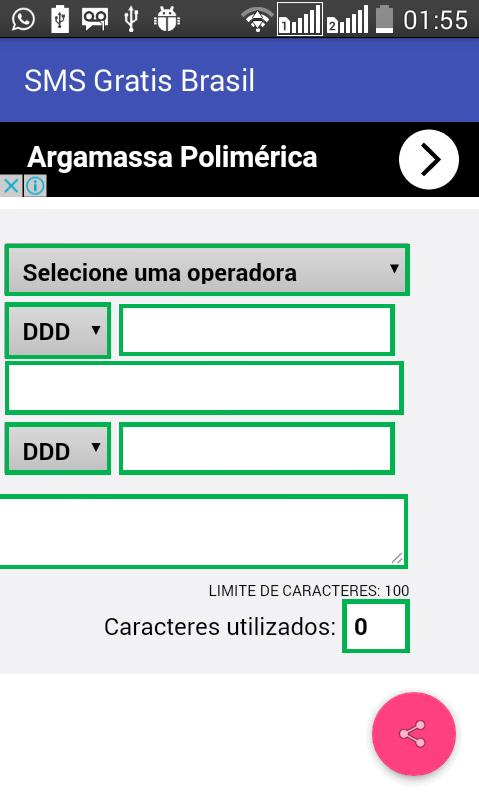
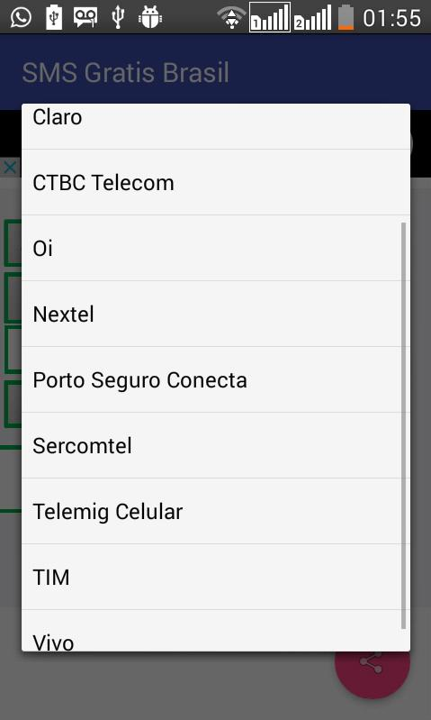
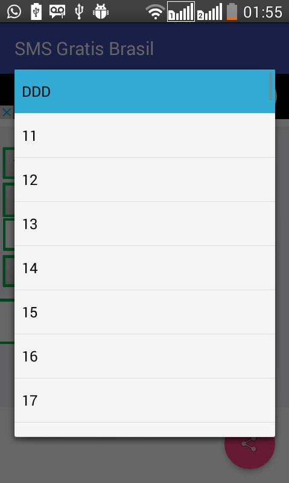
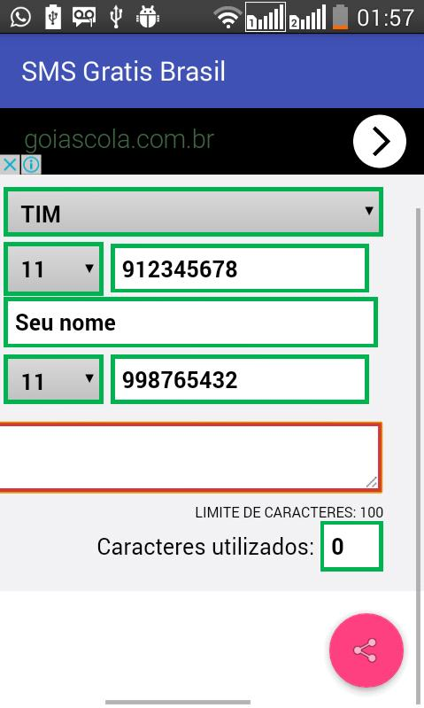

# SMS-Gratis-Brasil---Torpedos

PROJETO ANDROID (Arquivos e Códigos): 

Status: Descontinuado; 

Ano de publicação: 2016; 

Android: 4.0+; 

Última versão: 1.0; 

Identificação: brasil.gratis.sms.smsgratisbrasil; 

Link de acesso: https://apkpure.com/sms-gratis-brasil-torpedos/brasil.gratis.sms.smsgratisbrasil;

Descrição: 

Envie SMS's gratuitos para qualquer número e operadoras, a qualquer momento!

OPERADORAS:

Brasil Telecom
Claro
CTBC Telecom
Oi
Nextel
Porto Seguro
Sercomtel
Telemig Celular
TIM
Vivo
